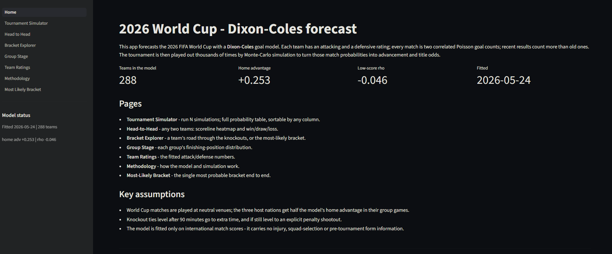

# FIFA World Cup 2026 — Dixon-Coles Forecast

[](https://fifawc2026pred.streamlit.app/)



A statistical forecast of the 2026 FIFA World Cup. A **Dixon-Coles** goal model
is fitted to decades of international match results, and the 48-team tournament
is then simulated thousands of times to produce advancement and title
probabilities. Results are explored through an interactive Streamlit app.

## Live Application

The interactive dashboard is deployed and available online:
👉 **[Launch the FIFA World Cup 2026 Forecast App](https://fifawc2026pred.streamlit.app/)**

## What it does

- **Dixon-Coles model** — every team gets an attacking and a defensive rating;
  each match is two correlated Poisson goal counts, with a low-score (`rho`)
  correction and exponential time-decay weighting so recent results count for
  more. Parameters are estimated by maximum likelihood.
- **Monte-Carlo simulation** — plays the full tournament (12 group
  round-robins, then the knockout bracket with extra time and penalty
  shootouts) many thousands of times and averages the outcomes.
- **Streamlit app** — a multi-page explorer for the forecast.

## Repository structure

```
fifa_wc_2026_pred/
├── README.md
├── requirements.txt
├── .gitignore
├── data/
│   ├── raw/
│   │   └── results.csv                     # input data (gitignored)
│   └── processed/
│       └── modeling/
│           ├── modeling_matrices_package.zip   # generated (gitignored)
│           ├── dixon_coles_params.json         # generated (COMMITTED)
│           └── wc2026_predictions.csv          # generated (gitignored)
├── output/
│   └── figures/
│       └── dashboard_preview.png           # generated plots & screenshots
├── src/
│   ├── model_data_cleaning.py    # clean raw results, train/test split
│   ├── dixon_coles.py            # the Dixon-Coles model: fit + predict
│   ├── wc2026_config.py          # the 2026 draw, bracket, third-place solver
│   └── simulate_wc2026.py        # Monte-Carlo tournament simulation
└── app/
    ├── Home.py                   # Streamlit entry point
    ├── lib.py                    # shared helpers for the app
    └── pages/
        ├── 1_Tournament_Simulator.py
        ├── 2_Head_to_Head.py
        ├── 3_Bracket_Explorer.py
        ├── 4_Group_Stage.py
        ├── 5_Team_Ratings.py
        ├── 6_Methodology.py
        └── 7_Most_Likely_Bracket.py
```

`dixon_coles_params.json` is the one generated file that is **committed** — a
deployed app cannot run the fitting scripts, so the fitted model must ship with
the repo. Everything else under `data/` is regenerated by the pipeline and is
gitignored.

## Setup

```
python -m venv venv
source venv/bin/activate           # Windows: venv\Scripts\activate
pip install -r requirements.txt
```

Place the input match-results file at `data/raw/results.csv`. It is a public
international-results dataset with the columns: `date`, `home_team`,
`away_team`, `home_score`, `away_score`, `tournament`, `city`, `country`,
`neutral`.

## Running the pipeline

Run the steps in order — each consumes the previous step's output.

```
python src/model_data_cleaning.py      # -> modeling_matrices_package.zip
python src/dixon_coles.py              # -> dixon_coles_params.json
python src/simulate_wc2026.py 20000    # -> wc2026_predictions.csv
```

## The Streamlit app

```
streamlit run app/Home.py
```

The app loads the fitted model (`dixon_coles_params.json`) and never refits —
run `src/dixon_coles.py` first. Pages:

- **Tournament Simulator** — run N simulations; full probability table.
- **Head-to-Head** — any two teams: scoreline heatmap and win/draw/loss.
- **Bracket Explorer** — a team's road through the knockouts.
- **Group Stage** — each group's finishing-position distribution.
- **Team Ratings** — the fitted attack/defense parameters.
- **Methodology** — how the model and simulation work.
- **Most-Likely Bracket** — the single most probable bracket.

Simulation results are cached (in memory and on disk via Streamlit), so
re-running the same settings is instant.

## Model assumptions

- World Cup matches are treated as neutral-venue; the three host nations get
  half the fitted home advantage in their group games only.
- A knockout tie level after 90 minutes goes to extra time (an independent
  30-minute period at one third the goal rate) and then to an explicit penalty
  shootout.
- The model sees only historical match scores — no injuries, squad selection,
  or pre-tournament form.
- Eight third-placed teams are slotted into the bracket with a solver that
  respects FIFA's official eligibility rules.

## Deployment notes

For an online deployment (e.g. Streamlit Community Cloud), `requirements.txt`
must be at the repository root and `dixon_coles_params.json` must be committed
so the hosted app has a model to load.
